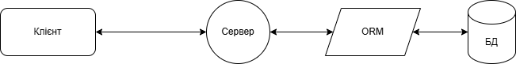
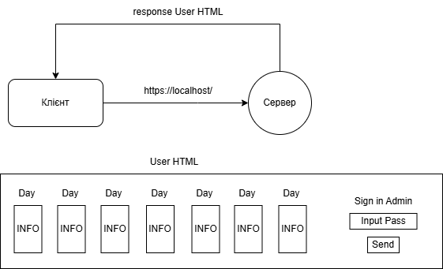
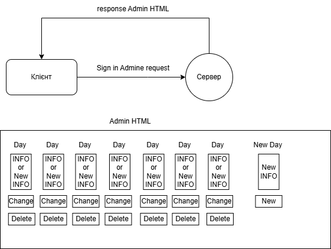
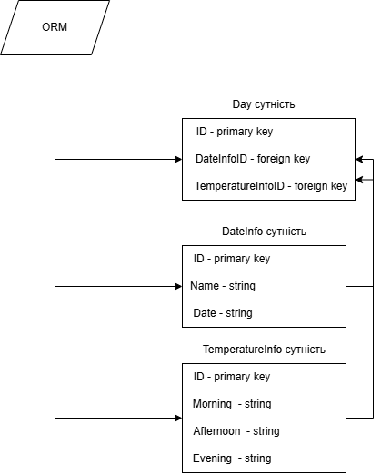

# Лабораторна робота No1. Використання фреймворку FastAPI та SQLAlchemy ORM для створення вебзастосунку мовою Python

## Завдання. Для заданої предметної галузі розробити RESTfull API вебзастосунок

1) Контент повинен генеруватися на сервері і у вигляді HTML відправляється на клієнт.
2) Дані мусять зберігатися у реляційній БД, наприклад, SQLite. Схема даних повинна містити щонайменша 3 сутності.
3) Для доступу до даних слід використовувати SQLAlchemy ORM.
4) Передбачити режими роботи акторів двох ролей: адміністратор та користувач.
5) Хоча б для однієї сутності реалізувати усі чотири CRUD-операції (create, read, update, delete).
6) Внести зміни в OpenAPI документацію за замовченням.

## Схеми

Структура застосунку

Основна сторінка, сторінка користувача

Сторінка адміністратора

Сутності

